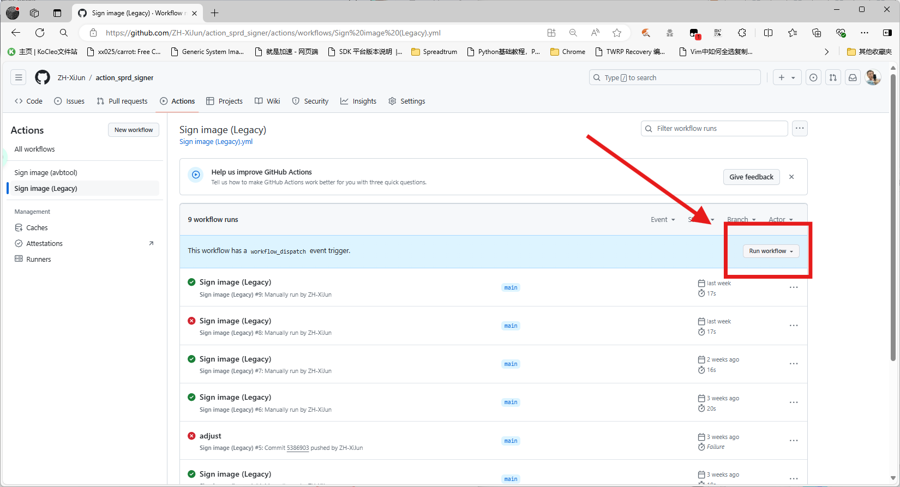
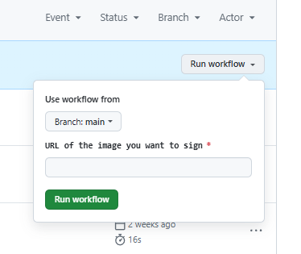

# Action SPRD image sign tool

我是[中国人](README-ZH.md)

Action Workflows to sign image for Unisoc/SPRD device.

# Introduce

As I know, two sign method are used by Unisoc. Please choose different signature methods based on your SoC model.

## AVBTOOL METHOD

> [!Warning]
> Avbtool method isn't yet tested. Try it at your own risk!

Workflow name: `Sign image (avbtool)`

Avbtool is a tool to read AVB2.0 (or avb1.0 support?) signed image and sign an image. Avbtool method means using avbtool to sign the image. Check [here](https://www.hovatek.com/forum/thread-32664.html) and [here](https://www.hovatek.com/forum/thread-32674.html) if you want to know how does it work.

For example, **SC9832E/SL8541E** uses Android Verified Boot 2.0 to sign and verify the image. It should use avbtool method.

Usually, if your device has vbmeta partition and it was not empty, you should use this method.

If you want to further confirm, you can check the header of your boot image and vbmeta image. The boot image uses common header (`ANDROID!` in the first 8 bytes) but vbmeta uses a different header (`DHTB` in the first 4 bytes) that avbtool can not read it correctly. 

## LEGACY METHOD

Workflow name: `Sign image (Legacy)`

This method seems to be used only in old SoCs. Unisoc has their own tool to sign the image.

For example, **SC9820E/SL8521E** uses this method to sign the image. Most of SC9820E devices using Android 4.4. But there're still some devices using Android 8.1.

I ain't sure, but if your device doesn't have vbmeta pertition or it was empty, you may need to use this method.

If you want to further confirm, you can check the header of your boot image. The boot image uses `DHTB` for it's header instead of `ANDROID!` so that bootimg unpacker can't read it correctly (but magiskboot and AIK seems working normally!). Actually, `ANDROID!` has been moved backwards by 512 bytes.

# How to use

You should provide `boot\recovery` image you want to sign. Original `vbmeta` image from your device is also needed if you are using avbtool method. **DON'T REMOVE DHTB HEADER IN YOUR VBMETA IMAGE!**

1. **Use `Fork` or `Use this template` to clone this reposity to your personal account**

2. **Upload your image to somewhere that can get the DIRECT LINK to your image. For example, I upload my image to this reposity and used "View raw" to get the link.**

3. **Open the `Actions` tab and choose a workflow. Read the [introduce](#introduce) to help you make decision.**

4. **Press `Run workflow` button, and fill in according to the above parameter description, then press `Run workflow`**

- If you choose `Sign image (Legacy)`, there's only one parameter you need to fill in.

- But if you choose `Sign image (avbtool)`, the number of parameters will increase to 5.

- The fourth parameter may be confusing. You can read back the boot/recovery partition of your device **correctly**. The size of the output file is the value of this parameter. **If you operate incorrectly, the size of the output file may change.**

5. **Just drink a tea and wait for a while. After a few seconds, the signed image will be uploaded to artifact. You can download it right now and flash into your device!**

